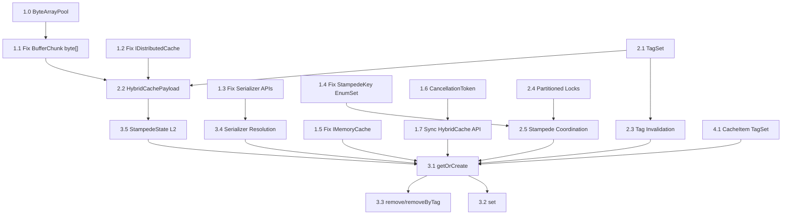

# Java HybridCache Implementation Plan

A comprehensive plan for completing the Java port of the C# [HybridCache](file:///e:/java/hybrid-cache/src/main/java/dev/shetty/abstractions/HybridCache.java#11-106) library, based on exhaustive analysis of both codebases.

---

## Executive Summary

The C# [HybridCache](file:///e:/java/hybrid-cache/src/main/java/dev/shetty/abstractions/HybridCache.java#11-106) is a production-grade, multi-tier caching library (~3000 lines across 20+ files) with L1 (in-process) + L2 (distributed) architecture, stampede protection, tag-based invalidation, a binary wire format, and pooled buffer management. The Java port (~2200 lines across 22 files) has a reasonable skeleton but contains **critical bugs**, **missing components**, and **API design issues** that must be resolved before it's functional.

This plan organizes the work into **5 phases**, each containing **feature-sized tasks** suitable for an AI agent to execute independently.

---

## Key Design Decision: Synchronous API + Virtual Threads

> [!IMPORTANT]
> **Decision: The public API will be synchronous.** `CompletableFuture` is used only internally for stampede coordination.

### Why Not CompletableFuture in the Public API?

The C# API uses `ValueTask<T>` because .NET's async/await model is pervasive and zero-allocation. In Java, the landscape is different since Java 21:

| Factor | CompletableFuture API | Synchronous API + Virtual Threads |
|---|---|---|
| **Code complexity** | Callers must chain `.thenApply()`, `.thenCompose()`, handle `.exceptionally()` | Callers write plain `try/catch`, imperative code |
| **Debuggability** | Stack traces are fragmented across callbacks | Full, clear stack traces |
| **Memory overhead** | Each `CompletableFuture` is a heap object (~40 bytes + closure) | Virtual threads are ~1KB, but no per-call wrapper objects |
| **Blocking safety** | Must never call `.join()` on a platform thread | Blocking is **free** on virtual threads — the JVM unmounts the carrier |
| **Java 24 pinning** | N/A | JEP 491 eliminates `synchronized` pinning concerns |
| **Learning curve** | High — requires understanding of async composition | Low — standard Java |
| **Cancellation** | `.cancel()` only prevents downstream, doesn't interrupt running tasks | `CancellationToken.cancel()` + cooperative check works naturally |

### The Architecture

```
┌──────────────────────────────────┐
│     Public API (Synchronous)     │  T getOrCreate(key, factory, ...)
│     void set(key, value, ...)    │  void remove(key)
│     void removeByTag(tag)        │
├──────────────────────────────────┤
│     Stampede Coordination        │  CompletableFuture<CacheItem<T>>
│     (Internal only)              │  Used so joiners can wait on initiator
├──────────────────────────────────┤
│     I/O Operations               │  Virtual threads for L2 reads/writes
│     (Internal only)              │  tag invalidation broadcasts
└──────────────────────────────────┘
```

**Why `CompletableFuture` is still needed internally**: Stampede protection requires multiple callers to **wait on the same result**. When caller A initiates a fetch and callers B, C, D arrive for the same key, they must "join" A's in-flight operation. A `CompletableFuture<CacheItem<T>>` is the natural shared result holder — joiners call `.join()` on it (which is cheap on a virtual thread) and get the result when the initiator completes.

**Caller expectations**: Users are expected to call the cache from virtual threads (or accept that platform thread blocking is their choice). This is the standard Java 24 library design pattern.

```java
// User code — simple, imperative, no callbacks
try (var executor = Executors.newVirtualThreadPerTaskExecutor()) {
    executor.submit(() -> {
        String value = cache.getOrCreate("key", (ct) -> expensiveLookup());
        process(value);
    });
}
```

---

## Gap Analysis

### What Java Has (Working or Partially Working)

| Component | Java File | Status |
|---|---|---|
| Array pooling | [SharedArrayPool](file:///e:/java/hybrid-cache/src/main/java/dev/shetty/internal/SharedArrayPool.java#20-439) (439 lines) | ✅ Working, tested |
| Buffer pooling | [RecyclableArrayBufferWriter](file:///e:/Cs.Projects/Cloned_Forked/dotnet%20aspnetcore%20main%20src-Caching_Hybrid_src/Internal/RecyclableArrayBufferWriter.cs#60-64) | ⚠️ Functional, uses `Byte[]` (boxed) |
| Buffer chunk | [BufferChunk](file:///e:/Cs.Projects/Cloned_Forked/dotnet%20aspnetcore%20main%20src-Caching_Hybrid_src/Internal/BufferChunk.cs#29-44) | ❌ Uses `Byte[]`, [doNotReturnToPool()](file:///e:/java/hybrid-cache/src/main/java/dev/shetty/internal/BufferChunk.java#80-89) mutates `this` |
| Cache items | [BaseCacheItem](file:///e:/java/hybrid-cache/src/main/java/dev/shetty/hybrid/BaseCacheItem.java#10-103), `CacheItem<T>`, `ImmutableCacheItem<T>`, `MutableCacheItem<T>` | ⚠️ Structure correct, missing [TagSet](file:///e:/Cs.Projects/Cloned_Forked/dotnet%20aspnetcore%20main%20src-Caching_Hybrid_src/Internal/TagSet.cs#27-32) |
| Immutability detection | [ImmutableTypeCache](file:///e:/Cs.Projects/Cloned_Forked/dotnet%20aspnetcore%20main%20src-Caching_Hybrid_src/Internal/ImmutableTypeCache.cs#21-80), `@ImmutableObject` | ✅ Working |
| Stampede key | [StampedeKey](file:///e:/Cs.Projects/Cloned_Forked/dotnet%20aspnetcore%20main%20src-Caching_Hybrid_src/Internal/DefaultHybridCache.StampedeKey.cs#11-54) | ❌ Single enum, should be `EnumSet` |
| Stampede state | [BaseStampedeState](file:///e:/java/hybrid-cache/src/main/java/dev/shetty/internal/BaseStampedeState.java#13-121), `StampedeState<TState, T>` | ⚠️ Partial |
| Options | [HybridCacheOptions](file:///e:/java/hybrid-cache/src/main/java/dev/shetty/internal/HybridCacheOptions.java#6-53), [HybridCacheEntryOptions](file:///e:/java/hybrid-cache/src/main/java/dev/shetty/internal/HybridCacheEntryOptions.java#11-57) | ⚠️ Single flag, should be `EnumSet` |
| DefaultHybridCache | 359 lines | ❌ Skeleton — methods return null |
| Public API | [HybridCache](file:///e:/java/hybrid-cache/src/main/java/dev/shetty/abstractions/HybridCache.java#11-106) abstract class | ❌ Synchronous but with wrong signatures |

### What Java Is Missing

| C# Component | Purpose | Priority |
|---|---|---|
| [TagSet](file:///e:/Cs.Projects/Cloned_Forked/dotnet%20aspnetcore%20main%20src-Caching_Hybrid_src/Internal/TagSet.cs#27-32) | Zero/one/many tag optimization | **High** |
| [HybridCachePayload](file:///e:/Cs.Projects/Cloned_Forked/dotnet%20aspnetcore%20main%20src-Caching_Hybrid_src/Internal/HybridCachePayload.cs#12-422) | Binary wire format for L2 | **High** |
| Tag invalidation system | Timestamp-based tag expiry | **High** |
| Partitioned sync locks | Minimize stampede contention | **Medium** |
| Stampede coordination | [GetOrCreateStampedeState](file:///e:/Cs.Projects/Cloned_Forked/dotnet%20aspnetcore%20main%20src-Caching_Hybrid_src/Internal/DefaultHybridCache.Stampede.cs#16-107) logic | **High** |
| `CancellationToken` | Cooperative cancellation | **Medium** |
| `ByteArrayPool` | Primitive `byte[]` pooling | **High** |
| Serializer resolution | Per-type serializer caching | **Medium** |

### Critical Bugs

> [!CAUTION]
> These bugs would cause data corruption or excessive memory usage.

1. **[BufferChunk](file:///e:/Cs.Projects/Cloned_Forked/dotnet%20aspnetcore%20main%20src-Caching_Hybrid_src/Internal/BufferChunk.cs#29-44) uses `Byte[]` (boxed)** — each byte becomes a 16-byte heap object. A 1KB payload costs ~16KB.
2. **`BufferChunk.doNotReturnToPool()` mutates `this`** — `BufferChunk copy = this;` copies the reference in Java, not the value. Mutates original.
3. **`IDistributedCache.get()` returns `Byte[]`** — should return `byte[]`.
4. **`IHybridCacheSerializerFactory.tryCreateSerializer` has wrong signature** — receives serializer instead of producing one.
5. **[StampedeKey](file:///e:/Cs.Projects/Cloned_Forked/dotnet%20aspnetcore%20main%20src-Caching_Hybrid_src/Internal/DefaultHybridCache.StampedeKey.cs#11-54) stores single `HybridCacheEntryFlags`** — should be `EnumSet` for flag combinations.
6. **`DefaultHybridCache.setAsync()` calls `localCache.set()` with `Duration`** — but `IMemoryCache.set()` doesn't accept duration.
7. **`DefaultHybridCache.getFromL2Direct()` manually boxes `byte[]` → `Byte[]`** — cascading from the `Byte[]` decision.
8. **`StampedeState.backgroundFetch()` creates new `EnumSet.of()` on every call** — should read pre-stored set.

---

## Proposed Changes

### Phase 1: Fix Foundational Types & API Design

> [!IMPORTANT]
> These fixes must come first because every other component depends on these types.

---

#### Feature 1.0: Create `ByteArrayPool`

##### [NEW] [ByteArrayPool.java](file:///e:/java/hybrid-cache/src/main/java/dev/shetty/internal/ByteArrayPool.java)

Specialized pool for primitive `byte[]` (the generic `ArrayPool<T>` can't pool primitives due to type erasure):
- Thread-local caching of `byte[]` per size bucket
- Per-CPU partitions (same strategy as [SharedArrayPool](file:///e:/java/hybrid-cache/src/main/java/dev/shetty/internal/SharedArrayPool.java#20-439))
- `byte[] take(int minimumLength)` / `void giveBack(byte[] array)`
- No autoboxing overhead

---

#### Feature 1.1: Fix [BufferChunk](file:///e:/Cs.Projects/Cloned_Forked/dotnet%20aspnetcore%20main%20src-Caching_Hybrid_src/Internal/BufferChunk.cs#29-44) to use `byte[]`

##### [MODIFY] [BufferChunk.java](file:///e:/java/hybrid-cache/src/main/java/dev/shetty/internal/BufferChunk.java)

```diff
-private final Byte[] oversizedArray;
+private final byte[] oversizedArray;

 public BufferChunk doNotReturnToPool() {
-    BufferChunk copy = this;
-    copy.lengthAndPoolFlag &= ~FLAG_RETURN_TO_POOL;
-    return copy;
+    return new BufferChunk(oversizedArray, offset, getLength(), false);
 }
```

---

#### Feature 1.2: Fix [IDistributedCache](file:///e:/java/hybrid-cache/src/main/java/dev/shetty/abstractions/IDistributedCache.java#8-36) to use `byte[]`

##### [MODIFY] [IDistributedCache.java](file:///e:/java/hybrid-cache/src/main/java/dev/shetty/abstractions/IDistributedCache.java)

```diff
-Byte[] get(String key);
-void set(String key, Byte[] value, CacheEntryOptions options);
+byte[] get(String key);
+void set(String key, byte[] value, CacheEntryOptions options);
```

---

#### Feature 1.3: Fix Serializer APIs

##### [MODIFY] [IHybridCacheSerializer.java](file:///e:/java/hybrid-cache/src/main/java/dev/shetty/abstractions/IHybridCacheSerializer.java)

```diff
-T deserialize(List<Byte> source);
-void serialize(T value, ByteBuffer target);
+T deserialize(ByteBuffer source);
+void serialize(T value, RecyclableArrayBufferWriter<Byte> target);
```

##### [MODIFY] [IHybridCacheSerializerFactory.java](file:///e:/java/hybrid-cache/src/main/java/dev/shetty/abstractions/IHybridCacheSerializerFactory.java)

```diff
-<T> boolean tryCreateSerializer(IHybridCacheSerializer<T> serializer);
+<T> IHybridCacheSerializer<T> tryCreateSerializer(Class<T> type);
```

---

#### Feature 1.4: Fix [StampedeKey](file:///e:/Cs.Projects/Cloned_Forked/dotnet%20aspnetcore%20main%20src-Caching_Hybrid_src/Internal/DefaultHybridCache.StampedeKey.cs#11-54) and [HybridCacheEntryOptions](file:///e:/java/hybrid-cache/src/main/java/dev/shetty/internal/HybridCacheEntryOptions.java#11-57) for `EnumSet`

##### [MODIFY] [StampedeKey.java](file:///e:/java/hybrid-cache/src/main/java/dev/shetty/internal/StampedeKey.java)

```diff
-private final HybridCacheEntryFlags flags;
+private final EnumSet<HybridCacheEntryFlags> flags;
```

##### [MODIFY] [HybridCacheEntryOptions.java](file:///e:/java/hybrid-cache/src/main/java/dev/shetty/internal/HybridCacheEntryOptions.java)

```diff
-private final HybridCacheEntryFlags flags;
+private final EnumSet<HybridCacheEntryFlags> flags;
```

---

#### Feature 1.5: Fix [IMemoryCache](file:///e:/java/hybrid-cache/src/main/java/dev/shetty/abstractions/IMemoryCache.java#5-26) to support expiration

##### [MODIFY] [IMemoryCache.java](file:///e:/java/hybrid-cache/src/main/java/dev/shetty/abstractions/IMemoryCache.java)

Add: `ICacheEntry set(Object key, Object value, Duration absoluteExpirationRelativeToNow);`

---

#### Feature 1.6: Create `CancellationToken`

##### [NEW] [CancellationToken.java](file:///e:/java/hybrid-cache/src/main/java/dev/shetty/internal/CancellationToken.java)

Lightweight cooperative cancellation (wraps `AtomicBoolean`):

```java
public final class CancellationToken {
    public static final CancellationToken NONE = new CancellationToken();

    private final AtomicBoolean cancelled = new AtomicBoolean(false);

    public boolean isCancelled()       { return cancelled.get(); }
    public void cancel()               { cancelled.set(true); }
    public void throwIfCancelled()     { if (cancelled.get()) throw new CancellationException(); }
}
```

---

#### Feature 1.7: Redesign [HybridCache](file:///e:/java/hybrid-cache/src/main/java/dev/shetty/abstractions/HybridCache.java#11-106) Public API — Synchronous + Virtual Thread Friendly

##### [MODIFY] [HybridCache.java](file:///e:/java/hybrid-cache/src/main/java/dev/shetty/abstractions/HybridCache.java)

```java
public abstract class HybridCache {

    // Primary — with state to avoid lambda captures
    public abstract <TState, T> T getOrCreate(
        String key, TState state,
        BiFunction<TState, CancellationToken, T> factory,
        HybridCacheEntryOptions options, Collection<String> tags,
        CancellationToken cancellationToken);

    // Convenience — no state
    public <T> T getOrCreate(
        String key,
        Function<CancellationToken, T> factory,
        HybridCacheEntryOptions options, Collection<String> tags,
        CancellationToken cancellationToken) { ... }

    // Minimal convenience
    public <T> T getOrCreate(String key, Function<CancellationToken, T> factory) { ... }

    public abstract <T> void set(String key, T value,
        HybridCacheEntryOptions options, Collection<String> tags,
        CancellationToken cancellationToken);

    public abstract void remove(String key, CancellationToken cancellationToken);
    public abstract void removeByTag(String tag, CancellationToken cancellationToken);
}
```

This API:
- Returns `T` directly — no wrapping in `CompletableFuture`
- Accepts `CancellationToken` for cooperative cancellation
- The factory receives a `CancellationToken` it can check during expensive work
- Blocking on L2 I/O is cheap when called from virtual threads

---

### Phase 2: Core Missing Components

---

#### Feature 2.1: Implement [TagSet](file:///e:/Cs.Projects/Cloned_Forked/dotnet%20aspnetcore%20main%20src-Caching_Hybrid_src/Internal/TagSet.cs#27-32)

##### [NEW] [TagSet.java](file:///e:/java/hybrid-cache/src/main/java/dev/shetty/internal/TagSet.java)

Optimized for 0, 1, or N tags:
- `TagSet.EMPTY` — singleton for zero tags
- `count()`, `getSingle()`, `getAll()`, `tryFind(String)`
- `Iterable<String>` support
- Factory: `TagSet.create(Collection<String> tags)`

---

#### Feature 2.2: Implement [HybridCachePayload](file:///e:/Cs.Projects/Cloned_Forked/dotnet%20aspnetcore%20main%20src-Caching_Hybrid_src/Internal/HybridCachePayload.cs#12-422)

##### [NEW] [HybridCachePayload.java](file:///e:/java/hybrid-cache/src/main/java/dev/shetty/internal/HybridCachePayload.java)

Binary wire format for L2:
- Write: sentinel + entropy + creation time + varint fields + UTF-8 strings + payload + trailing sentinel
- Parse: reverse with integrity checks, expiration validation, tag expiration checks
- Varint encoding (7-bit)
- Result enum: [Success](file:///e:/java/hybrid-cache/src/main/java/dev/shetty/hybrid/DefaultHybridCache.java#355-356), `FormatNotRecognized`, `InvalidData`, `InvalidKey`, `ExpiredByEntry`, `ExpiredByTag`, etc.

---

#### Feature 2.3: Implement Tag Invalidation System

##### [NEW] [TagInvalidation.java](file:///e:/java/hybrid-cache/src/main/java/dev/shetty/internal/TagInvalidation.java)

- `ConcurrentHashMap<String, Long>` for local timestamps
- `isTagExpired()`, `isWildcardExpired()`, `invalidateTagLocal()`, `invalidateL2Tag()`
- `prefetchTagTimestamps()` — reads from L2

---

#### Feature 2.4: Implement Partitioned Sync Locks

##### [NEW] [PartitionedSyncLock.java](file:///e:/java/hybrid-cache/src/main/java/dev/shetty/internal/PartitionedSyncLock.java)

8 `ReentrantLock` instances, selected by `hashCode & 0b111`. With Java 24's JEP 491 fixing `synchronized` pinning, we could use plain `synchronized` instead, but `ReentrantLock` remains cleaner for this use case.

---

#### Feature 2.5: Implement Stampede Coordination

##### [MODIFY] [DefaultHybridCache.java](file:///e:/java/hybrid-cache/src/main/java/dev/shetty/hybrid/DefaultHybridCache.java)

`getOrCreateStampedeState()` — double-checked locking with partitioned locks:
1. Check `stampedeStates.get(key)` first (lock-free)
2. If found and same type, try [tryAddCaller()](file:///e:/java/hybrid-cache/src/main/java/dev/shetty/internal/BaseStampedeState.java#112-120) → join existing
3. Under partitioned lock: re-check → `computeIfAbsent()` → insert new state

---

### Phase 3: Complete DefaultHybridCache

---

#### Feature 3.1: Wire up [getOrCreate](file:///e:/java/hybrid-cache/src/main/java/dev/shetty/hybrid/DefaultHybridCache.java#35-39) — Full Pipeline

L1 check → stampede join-or-create → L2 read → factory invoke → serialize → L1 write → L2 write → return.

Joiners call `stampede.getTask().join()` — **cheap on virtual threads**.

---

#### Feature 3.2: Wire up [set](file:///e:/java/hybrid-cache/src/main/java/dev/shetty/abstractions/HybridCache.java#52-61) — Direct Write

Create stampede state with L1+L2 read flags disabled → execute directly.

---

#### Feature 3.3: Wire up [remove](file:///e:/java/hybrid-cache/src/main/java/dev/shetty/abstractions/HybridCache.java#62-66) and [removeByTag](file:///e:/java/hybrid-cache/src/main/java/dev/shetty/abstractions/HybridCache.java#84-100)

- [remove](file:///e:/java/hybrid-cache/src/main/java/dev/shetty/abstractions/HybridCache.java#62-66): evict from L1, delete from L2
- [removeByTag](file:///e:/java/hybrid-cache/src/main/java/dev/shetty/abstractions/HybridCache.java#84-100): record tag invalidation timestamp, write to L2 tag key

---

#### Feature 3.4: Implement Serializer Resolution & Caching

`ConcurrentHashMap<Class<?>, IHybridCacheSerializer<?>>` — factory chain resolution.

---

#### Feature 3.5: Update `StampedeState.backgroundFetch()` — Full L2 Pipeline

Integrate [HybridCachePayload](file:///e:/Cs.Projects/Cloned_Forked/dotnet%20aspnetcore%20main%20src-Caching_Hybrid_src/Internal/HybridCachePayload.cs#12-422) for L2 reads/writes, add [TagSet](file:///e:/Cs.Projects/Cloned_Forked/dotnet%20aspnetcore%20main%20src-Caching_Hybrid_src/Internal/TagSet.cs#27-32), fix `EnumSet` usage.

---

### Phase 4: CacheItem TagSet Integration

#### Feature 4.1: Add [TagSet](file:///e:/Cs.Projects/Cloned_Forked/dotnet%20aspnetcore%20main%20src-Caching_Hybrid_src/Internal/TagSet.cs#27-32) to [BaseCacheItem](file:///e:/java/hybrid-cache/src/main/java/dev/shetty/hybrid/BaseCacheItem.java#10-103)

```diff
+private TagSet tags = TagSet.EMPTY;
+public TagSet getTags() { return tags; }
+public void setTags(TagSet tags) { this.tags = tags; }
```

---

## Implementation Order



**Suggested sequence**: Phase 1 (all) → Phase 2.1 → 4.1 → 2.3 → 2.4 → 2.5 → 2.2 → 3.5 → 3.4 → 3.1 → 3.2 → 3.3 → Tests

---

## Verification Plan

### Build: `mvn compile` (must pass after every phase)
### Tests: `mvn test`

#### Existing Tests (must continue to pass)
- [ArrayPoolTest.java](file:///e:/java/hybrid-cache/src/test/java/dev/shetty/internal/ArrayPoolTest.java)
- [SharedArrayPoolTest.java](file:///e:/java/hybrid-cache/src/test/java/dev/shetty/internal/SharedArrayPoolTest.java)

#### New Tests

| Test Class | What It Tests |
|---|---|
| `ByteArrayPoolTest` | Primitive `byte[]` pooling correctness |
| `TagSetTest` | Empty, single, multi-tag; `tryFind()`; iteration |
| `BufferChunkTest` | `byte[]` ops, [doNotReturnToPool()](file:///e:/java/hybrid-cache/src/main/java/dev/shetty/internal/BufferChunk.java#80-89) safety |
| `StampedeKeyTest` | Equality with `EnumSet` flags, hash code |
| `HybridCachePayloadTest` | Write → Parse round-trip, varint, sentinel |
| `CancellationTokenTest` | Cancel/check semantics |
| `DefaultHybridCacheTest` | L1 get/set/remove, L1+L2, stampede protection, tag invalidation |

#### Stampede Concurrency Test

```java
// Launch N virtual threads, all calling getOrCreate("same-key", ...)
// Assert factory invoked exactly ONCE
// Assert all N threads receive the same value
```
